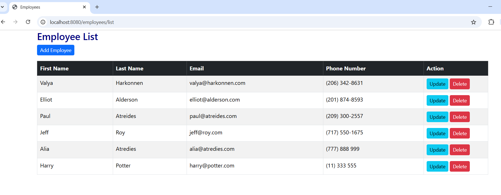
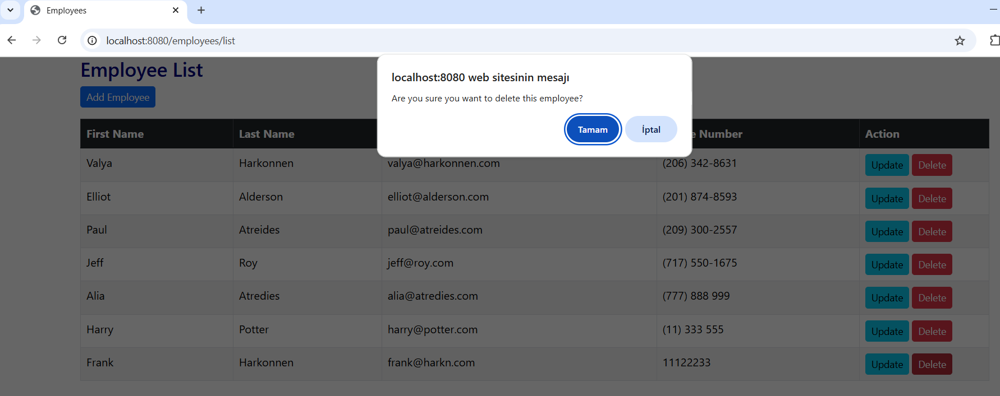

# Employee CRUD Uygulaması (Spring Boot + MVC + Thymeleaf + MySQL)

Bu proje, Spring Boot kullanarak geliştirilmiş basit bir **Çalışan (Employee) CRUD** (Create, Read, Update, Delete) uygulamasıdır. Uygulama, Thymeleaf ile HTML sayfalarını render eder ve verileri MySQL veritabanında saklar.

## 🚀 Özellikler

- Yeni çalışan ekleme
- Mevcut çalışanları listeleme
- Çalışan bilgilerini güncelleme
- Çalışan silme
- Thymeleaf ile responsive HTML arayüz
- MySQL veritabanı kullanımı

## 🧰 Kullanılan Teknolojiler

- Java 17+
- Spring Boot
- Spring MVC
- Spring Data JPA
- Thymeleaf
- MySQL
- Bootstrap 5

## 🖼️ Screenshots

### 1. Employee List

### 2. Add Employee Page

### 3. Delete Employee

